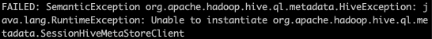

# Hive_Metastore_Error_fix



## Step 1: Vagrant up

Download ubuntu_vagrant folder above and vagrant up

## Step 2: SSH KeyGen 

Run the following two commands:

```
ssh-keygen -t rsa -P '' -f ~/.ssh/id_rsa
cat ~/.ssh/id_rsa.pub >> ~/.ssh/authorized_keys
```

## Step 3: Format Hadoop Namenode

```
cd /usr/local/hadoop/bin
hadoop namenode -format
```

## Step 4: Start hadoop daemons and test hive

- Start daemons using: 
```
cd /usr/local/hadoop/sbin
./start-all.sh
```
- Launch hive and test if it works by creating a table
```
create table example( i int, v varchar(10) );
```
